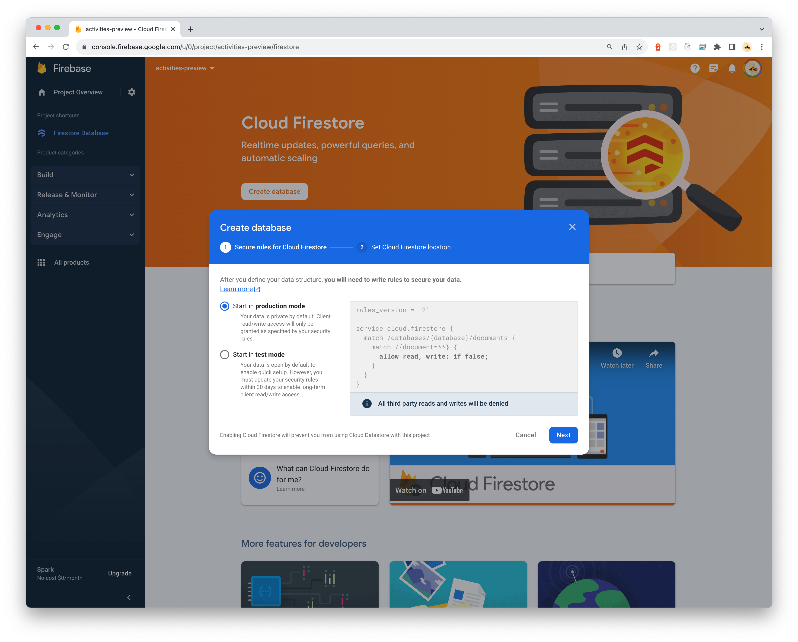
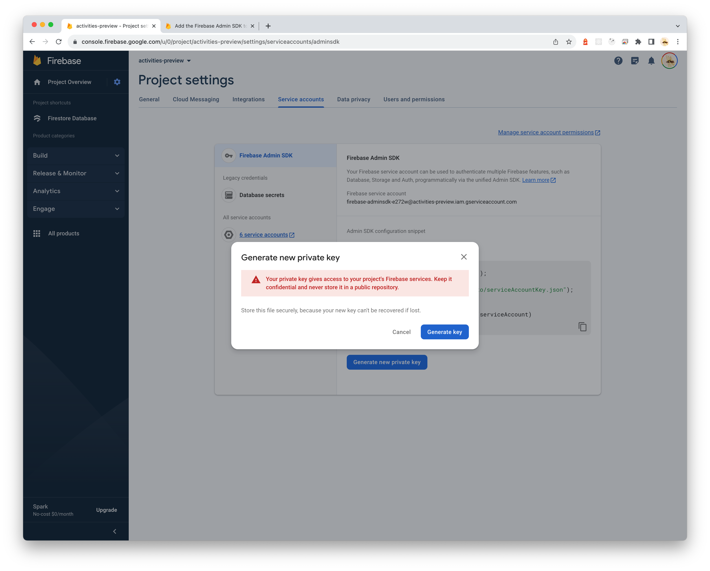

# Firebase/Firestore Setup Guide

This guide will help you set up Activity.next using Google Firestore/Firebase Firestore as your database backend.

## Prerequisites

- Node.js 18+ and Yarn
- Git (to clone the repository)
- Google Cloud Platform account or Firebase account

## Firestore Setup

1. Create a Firestore database in the Google Cloud Console or Firebase Console:



The security rules selected during setup don't matter, as we'll be using service account authentication.

2. Add the following indexes to Firestore:

- Collection `statuses`, `actorId` Ascending, `createdAt` Descending
- Collection `statuses`, `reply` Ascending, `createdAt` Descending
- Collection `statuses`, `actorId` Ascending, `reply` Ascending, `createdAt` Descending
- Collection `statuses`, `to` Arrays, `actorId` Ascending, `createdAt` Descending
- Collection `follows`, `actorId` Ascending, `status` Ascending, `targetActorId` Ascending, `createdAt` Descending
- Collection `timelines`, `timeline` Ascending, `createdAt` Descending
- Collection group `accountProviders`, `provider` Ascending, `accountId` Ascending
- Collection group `accountProviders`, `provider` Ascending, `providerAccountId` Ascending
- Collection group `attachments`, `actorId` Ascending, `createdAt` Descending
- Collection group `attachments`, `actorId` Ascending, `createdAt` Ascending
- Exemptions collection group `sessions`, `token` Ascending
- Exemptions collection group `timeline`, `statusId` Ascending
- Exemptions collection group `attachments`, `actorId` Descending

3. Create a service account and private key:

Go to "Service accounts" in your Firebase or GCP console, and create a private key for SDK access:



4. Configure the database connection:

Create a `config.json` file in the project root with the following content:

```json
{
  "database": {
    "type": "firebase",
    "projectId": "your-firebase-project-id",
    "credentials": {
      "client_email": "client_email_from_service_account_key.json",
      "private_key": "private_key_from_service_account_key.json"
    }
  }
}
```

Alternatively, you can set this as an environment variable:

```
ACTIVITIES_DATABASE='{"type":"firebase","projectId":"your-firebase-project-id","credentials":{"client_email":"client_email_from_service_account_key.json","private_key":"private_key_from_service_account_key.json"}}'
```

## Development Setup

1. Clone the repository:

```bash
git clone https://github.com/llun/activities.next.git
cd activities.next
```

2. Install dependencies:

```bash
yarn install
```

3. Configure the environment (in addition to database settings above):

Add the following to your `config.json` file:

```json
{
  "host": "your-domain.tld",
  "secretPhase": "your-random-secret-for-sessions",
  "allowEmails": ["your-email@example.com"],
  "auth": {
    "github": {
      "id": "github-app-client-id",
      "secret": "github-app-secret"
    }
  }
}
```

4. Start the Firestore emulator for local development (optional):

```bash
yarn start:firestore
```

5. Run the development server:

```bash
yarn dev
```

## Using with a Tunnel for Local Development

To run Activity.next locally and communicate with other federated servers, you'll need a tunnel service that exposes your local server to the internet:

1. Set up a tunnel service like [Cloudflare Tunnel](https://www.cloudflare.com/products/tunnel/) or [ngrok](https://ngrok.com/)
2. Point the tunnel to localhost:3000
3. Use your tunnel's domain as the `host` in your configuration

## Production Deployment with Firestore

For production deployment with Firestore:

1. Make sure your service account has the appropriate permissions
2. Consider setting up monitoring for your Firestore database
3. Be aware of Firestore pricing and quotas for your expected usage

For Vercel deployment, add your Firestore configuration as an environment variable.

### Docker Deployment with Firestore

To deploy Activity.next with Firestore using Docker:

```bash
docker run -p 3000:3000 \
  -e ACTIVITIES_HOST=your.domain.tld \
  -e ACTIVITIES_SECRET_PHASE=random-secret-for-cookie \
  -e NEXTAUTH_URL=https://your.domain.tld \
  -e NEXTAUTH_SECRET=session-secret \
  -e ACTIVITIES_DATABASE_TYPE=firebase \
  -e ACTIVITIES_DATABASE='{"type":"firebase","projectId":"your-firebase-project-id","credentials":{"client_email":"client_email_from_service_account_key.json","private_key":"private_key_from_service_account_key.json"}}' \
  ghcr.io/llun/activities.next:latest
```

Alternatively, you can mount a configuration file instead of passing the database configuration as an environment variable:

```bash
docker run -p 3000:3000 \
  -e ACTIVITIES_HOST=your.domain.tld \
  -e ACTIVITIES_SECRET_PHASE=random-secret-for-cookie \
  -e NEXTAUTH_URL=https://your.domain.tld \
  -e NEXTAUTH_SECRET=session-secret \
  -v /path/to/config.json:/opt/activities.next/config.json \
  ghcr.io/llun/activities.next:latest
```

Where `/path/to/config.json` contains your complete configuration including the Firebase credentials.