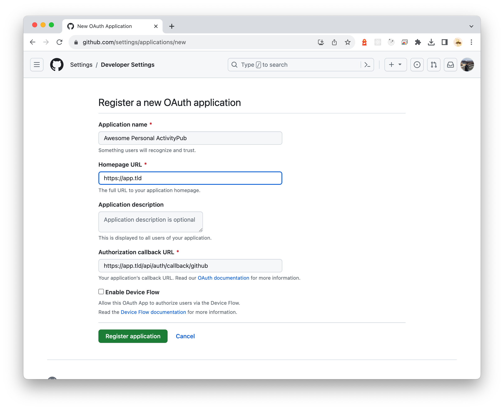

# Activity.next Setup Guide

This guide provides an overview of how to set up Activity.next for development or production.

## Database Setup

Activity.next supports multiple SQL database backends. Choose the one that best suits your needs:

- [SQLite Setup Guide](sqlite-setup.md) - Best for development or small instances
- [PostgreSQL Setup Guide](postgresql-setup.md) - Recommended for production deployments

## General Configuration

Regardless of which database you choose, you'll need the following configuration:

### Domain Name Configuration

Set your instance's domain name:

```json
{
  "host": "your-domain.tld"
}
```

### Access Control

Restrict who can sign up to your instance by specifying allowed emails:

```json
{
  "allowEmails": ["your_email@example.com"]
}
```

### Authentication Secret

Set a secret phrase for cookies and JWT sessions:

```json
{
  "secretPhase": "your-random-secret-for-sessions"
}
```

### Authentication Providers

The service includes local username/password authentication by default.

For GitHub OAuth authentication:

1. Create a GitHub OAuth app in your GitHub settings
   

2. Set the callback URL to `https://your-domain.tld/api/auth/callback/github`

3. Add the credentials to your config:

```json
{
  "auth": {
    "github": {
      "id": "github-app-client-id",
      "secret": "github-app-secret"
    }
  }
}
```

## Starting the Application

### Development Environment

To run the service locally:

```bash
yarn dev
```

To communicate with other servers in the fediverse while running locally, you'll need a tunnel service like [Cloudflare Tunnel](https://www.cloudflare.com/products/tunnel/) or [ngrok](https://ngrok.com/).

### First-Time Setup

After starting the application:

1. Sign up at `https://your-domain.tld/auth/signup` (if your email is in the allowlist)
2. Log in with your new account
3. You can now interact with other ActivityPub servers in the fediverse

## Deployment Options

Activity.next can be deployed in various ways:

### Vercel Deployment

To deploy on Vercel:

1. Fork this repository
2. Connect it to your Vercel account
3. Add the required environment variables (see database-specific setup guides)

### Docker Deployment

Activity.next provides official Docker images at `ghcr.io/llun/activities.next:latest`.

Basic docker run command:

```bash
docker run -p 3000:3000 \
  -e ACTIVITIES_HOST=your.domain.tld \
  -e ACTIVITIES_SECRET_PHASE=random-secret-for-cookie \
  -e NEXTAUTH_URL=https://your.domain.tld \
  -e NEXTAUTH_SECRET=session-secret \
  -v /path/to/local/storage:/opt/activities.next \
  ghcr.io/llun/activities.next:latest
```

For database-specific Docker deployment instructions:

- [SQLite Docker Deployment](sqlite-setup.md#docker-deployment-with-sqlite)
- [PostgreSQL Docker Deployment](postgresql-setup.md#docker-deployment-with-postgresql)
