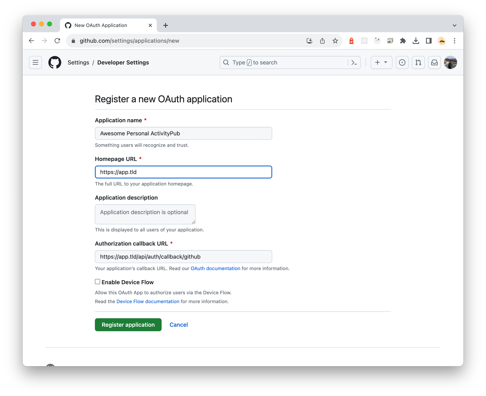

# Activity.next Setup Guide

This guide provides an overview of how to set up Activity.next for development or production.

## Prerequisites

- **Node.js 24** or higher
- **Yarn** package manager (v4.12.0 via Corepack)
- **Git** (to clone the repository)
- A **domain name** (required for federation with other servers)

## Database Setup

Activity.next supports multiple SQL database backends. Choose the one that best suits your needs:

- [SQLite Setup Guide](sqlite-setup.md) — Best for development or small instances
- [PostgreSQL Setup Guide](postgresql-setup.md) — Recommended for production deployments

## General Configuration

Activity.next can be configured through a `config.json` file in the project root or through environment variables prefixed with `ACTIVITIES_`. Environment variables take the form `ACTIVITIES_<SECTION>_<KEY>`.

For a complete reference of all configuration options, see the [Environment Variables Guide](environment-variables.md).

### Required Configuration

At minimum, you need to configure these settings:

#### Domain Name

Set your instance's domain name (without protocol or trailing slash):

```json
{
  "host": "your-domain.tld"
}
```

Or via environment variable:

```bash
ACTIVITIES_HOST=your-domain.tld
```

#### Authentication Secret

Set a secret phrase for signing cookies and tokens:

```json
{
  "secretPhase": "your-random-secret-for-sessions"
}
```

Or via environment variable:

```bash
# Generate with: openssl rand -base64 32
ACTIVITIES_SECRET_PHASE=your-random-secret-for-sessions
```

### Access Control

Restrict who can sign up to your instance by specifying allowed email addresses:

```json
{
  "allowEmails": ["your_email@example.com"]
}
```

Or via environment variable (JSON array):

```bash
ACTIVITIES_ALLOW_EMAILS='["your_email@example.com"]'
```

> **Tip:** If `allowEmails` is set, only users with matching email addresses can register. This is recommended for personal or small-group instances.

### Authentication Providers

Activity.next uses [better-auth](https://www.better-auth.com/) for authentication and supports local email/password accounts by default.

#### GitHub OAuth (Optional)

To enable GitHub sign-in:

1. Create a GitHub OAuth app in your [GitHub Developer Settings](https://github.com/settings/developers)

   

2. Set the callback URL to `https://your-domain.tld/api/auth/callback/github`

3. Add the credentials to your config:

```json
{
  "auth": {
    "github": {
      "id": "github-app-client-id",
      "secret": "github-app-secret"
    }
  }
}
```

Or via environment variables:

```bash
ACTIVITIES_AUTH_GITHUB_ID=github-app-client-id
ACTIVITIES_AUTH_GITHUB_SECRET=github-app-secret
```

### Media Storage (Optional)

By default, media files are not stored (uploads are disabled). To enable media uploads, configure a storage backend:

#### Local Filesystem

```bash
ACTIVITIES_MEDIA_STORAGE_TYPE=fs
ACTIVITIES_MEDIA_STORAGE_PATH=./uploads
```

#### S3 / S3-Compatible Object Storage

```bash
ACTIVITIES_MEDIA_STORAGE_TYPE=s3          # or 'object' for S3-compatible
ACTIVITIES_MEDIA_STORAGE_BUCKET=my-bucket
ACTIVITIES_MEDIA_STORAGE_REGION=us-east-1
# Optional: for S3-compatible services (MinIO, DigitalOcean Spaces, etc.)
ACTIVITIES_MEDIA_STORAGE_HOSTNAME=s3.example.com
```

Optional storage limits:

```bash
ACTIVITIES_MEDIA_STORAGE_MAX_FILE_SIZE=10485760      # 10 MB in bytes
ACTIVITIES_MEDIA_STORAGE_QUOTA_PER_ACCOUNT=104857600  # 100 MB in bytes
```

### Email Configuration (Optional)

Email is used for account verification and notifications. Supported providers:

#### SMTP

```bash
ACTIVITIES_EMAIL_TYPE=smtp
ACTIVITIES_EMAIL_FROM=noreply@your-domain.tld
ACTIVITIES_EMAIL_SMTP_HOST=smtp.example.com
ACTIVITIES_EMAIL_SMTP_PORT=587
ACTIVITIES_EMAIL_SMTP_USER=your-username
ACTIVITIES_EMAIL_SMTP_PASSWORD=your-password
ACTIVITIES_EMAIL_SMTP_SECURE=true
```

#### Resend

```bash
ACTIVITIES_EMAIL_TYPE=resend
ACTIVITIES_EMAIL_FROM=noreply@your-domain.tld
ACTIVITIES_EMAIL_RESEND_TOKEN=re_xxxxxxxxxxxx
```

#### AWS SES

```bash
ACTIVITIES_EMAIL_TYPE=ses
ACTIVITIES_EMAIL_FROM=noreply@your-domain.tld
ACTIVITIES_EMAIL_SES_REGION=us-east-1
```

### Queue Configuration (Optional)

Background jobs (sending ActivityPub activities, processing uploads) use a queue. Without a queue configured, jobs run synchronously.

#### Upstash QStash

```bash
ACTIVITIES_QUEUE_TYPE=qstash
ACTIVITIES_QUEUE_URL=https://your-domain.tld
ACTIVITIES_QUEUE_TOKEN=your-qstash-token
ACTIVITIES_QUEUE_CURRENT_SIGNING_KEY=your-signing-key
ACTIVITIES_QUEUE_NEXT_SIGNING_KEY=your-next-signing-key
```

## Starting the Application

### Development Environment

To run the service locally:

```bash
yarn dev
```

The app will be available at `http://localhost:3000`.

To communicate with other servers in the Fediverse while running locally, you'll need a tunnel service to expose your local server to the internet:

1. Set up a tunnel using [Cloudflare Tunnel](https://www.cloudflare.com/products/tunnel/) or [ngrok](https://ngrok.com/)
2. Point the tunnel to `localhost:3000`
3. Use your tunnel's domain as the `host` in your configuration

### First-Time Setup

After starting the application:

1. Navigate to `https://your-domain.tld/auth/signup` (your email must be in the allow list)
2. Create your account with email and password
3. Log in and start interacting with the Fediverse

## Deployment Options

### Vercel Deployment

To deploy on Vercel:

1. Fork this repository
2. Connect it to your Vercel account
3. Add the required environment variables (see [Environment Variables Guide](environment-variables.md))

> **Note:** Vercel deployments require an external PostgreSQL database and S3-compatible storage since Vercel has no persistent filesystem.

### Docker Deployment

Activity.next provides official Docker images at `ghcr.io/llun/activities.next:latest`.

Basic Docker run command (uses SQLite by default):

```bash
docker run -p 3000:3000 \
  -e ACTIVITIES_HOST=your.domain.tld \
  -e ACTIVITIES_SECRET_PHASE=random-secret-for-cookie \
  -v /path/to/local/storage:/opt/activities.next \
  ghcr.io/llun/activities.next:latest
```

For database-specific Docker deployment instructions:

- [SQLite Docker Deployment](sqlite-setup.md#docker-deployment-with-sqlite)
- [PostgreSQL Docker Deployment](postgresql-setup.md#docker-deployment-with-postgresql)
